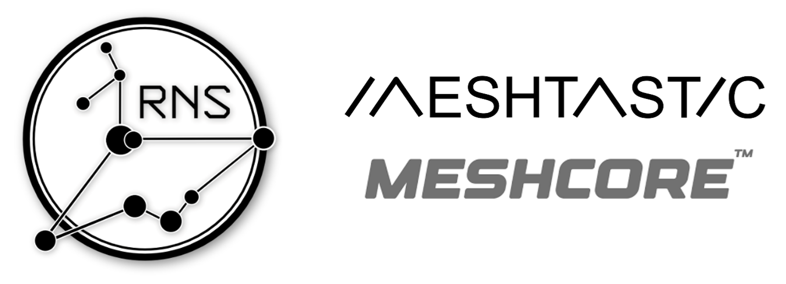

 

 

# nRF52840 E22P868M30S Solar LoRa Node
 
Ultra Low Power Solar LoRa Node (about 25mA) 
Can operate for weeks during the dark days of winter 
Compatible with Reticulum, Meshcore, Meshtastic, ... 
 
•	LoRa module <b>E22P-868M30S</b> (<b>1 Watt</b>, PA up to 32dBm, Ultra LNA, SAW filters, …) 
•	<b>nRF52840</b> SoC UltraLow Power 
•	Configuration OLED Screen 
•	Telemetry : Temperature and Humidity (<b>AHT20</b>) 
•	Telemetry : Batteries Voltage and Current (<b>INA219</b>) 
•	Watchdog and Scheduled <b>Automatic Restart</b> (PIC <b>16F13124</b>) 
•	RGB LED : Displays battery charging and Watchdog status 
•	Battery charging protection <b>NTC sensor</b>, temperature range from -2°C to 55°C 
•	<b>Dual-independent</b> battery protection. If one fails, the other works (2* DW07D) 
•	2* 18650 Li-ion batteries (<b>Lii-King4000</b>) for a total actual capacity of 7000mAh 
•	IP68 waterproof enclosure + double cable glands 
•	<b>Solar Panel</b> waterproof and unbreakable <b>6 Watts Actual</b> (325 cm² = <b>50 square inches</b>) 
•	<b>3 dBi antenna</b> (TX868-JKD-20) Tuned with enclosure : SWR≈1 @869,5MHz (with NanoVNA)  
•	Dedicated 64Mb Flash memory (W25Q64JV) to <b>Reticulum Transport Node</b> (Path table)  
 
To be at the maximum permitted power in Europe : <b>29,15 dBm EIRP</b>,  
The LoRa output power (sx1262) must be set to <b>8 dBm</b> in Meshtatic, Meshcore, RTNode, … 
 

 

 

 

